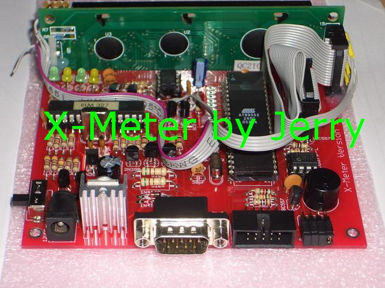

0,0 @@
# Hardware Image Gallery

This file displays images of the X-Meter hardware components and related PC software screenshots.

## Hardware

## PC Utility Screenshots

## Schematics and PCB Layouts

### Version 1

### Version 2

