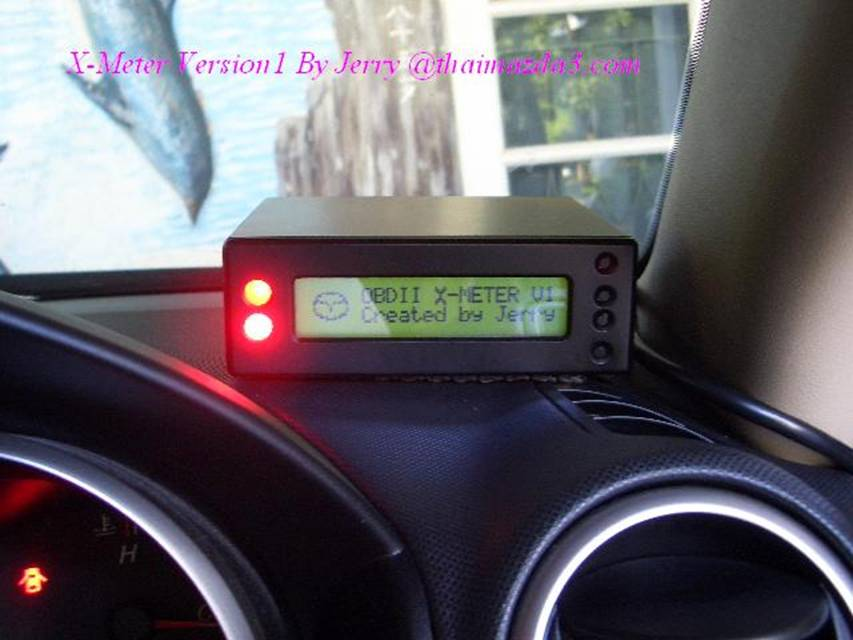
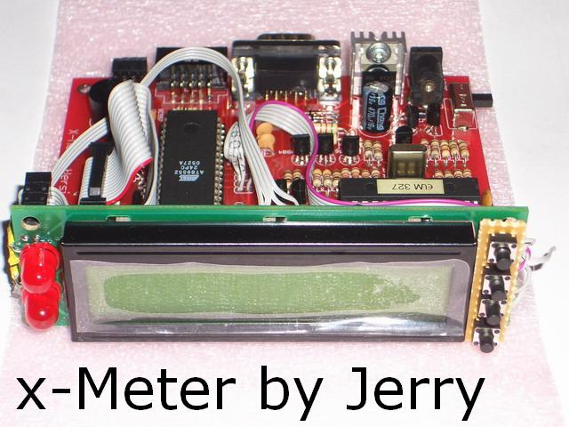
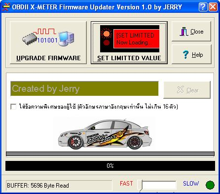
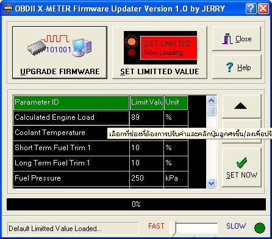

# X-Meter: A DIY OBD2 Multi-Gauge and Diagnostic Tool (c. 2007)

## Introduction

This repository contains the complete project files for the X-Meter, a custom-built hardware device for automotive diagnostics and real-time data display. This legacy project was developed by "Jerry" around 2007 as a passion project for the car enthusiast community.

The X-Meter connects to a vehicle's OBD2 port and provides a wealth of information, acting as a multi-gauge, trip computer, and diagnostic scanner.

## Core Technology

*   **Microcontroller:** The hardware is powered by an 8051-family microcontroller.
*   **OBD2 Interface:** It uses an ELM327-compatible chip for vehicle communication.
*   **Firmware:** The firmware is written in Assembly language.
*   **PC Software:** The updater and configuration utility was programmed in Delphi 7.

## Features

*   **Real-time Data Display:** Shows two selectable engine parameters simultaneously (e.g., RPM, vehicle speed, coolant temp, engine load, etc.).
*   **Diagnostic Tool:** Can read and clear Diagnostic Trouble Codes (DTCs) and reset the Powertrain Control Module (PCM).
*   **Customizable Alerts:** Set visual and audible warnings for user-defined limits (e.g., high coolant temperature).
*   **Configurable Interface:** Adjust backlight, sound, and auto-sleep settings.
*   **Expandable:** The hardware design includes an extension port for future functionality.

## Gallery

| Front View | Rear View |
|:---:|:---:|
|  |  |

| Updater Software | Warning Limit Feature |
|:---:|:---:|
|  |  |

## Project Structure

*   `Hardware/`: Contains hardware design files (schematics, PCB layouts for v1 and v2) and hardware images.
*   `Webpage/`: The original HTML webpage and images used to document the project.
*   `XFirmware/`: The 8051 assembly source code (`.asm`) and compiled firmware (`.hex`).
*   `Hex2Const/`: A Delphi 7 project for the PC-based firmware updater and configuration utility.
*   `XUpdater/`: Files related to the firmware updater tool.
*   `XMETER_protytype/`: (Outdated) Files from the early prototyping stage.

## Disclaimer

This is a legacy project from 2007. The files are provided as-is for historical and educational purposes. Some of the tools, libraries, and links in the original documentation may be outdated.

## Credits

This project was designed and developed by **Jerry**.