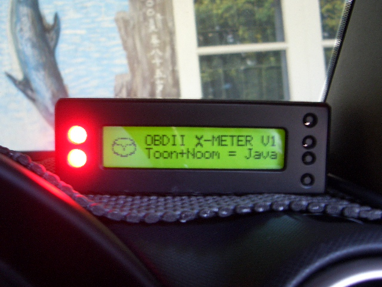
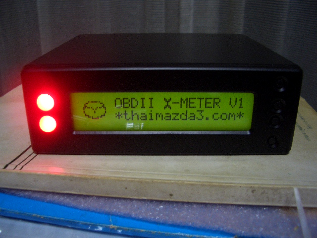
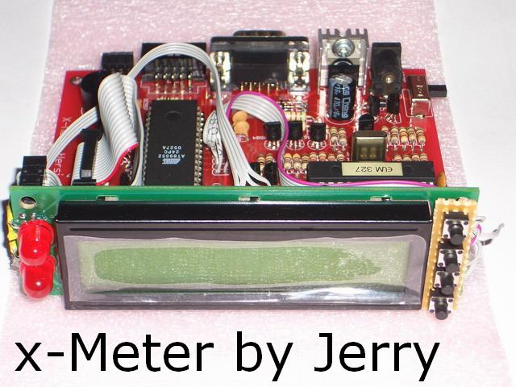
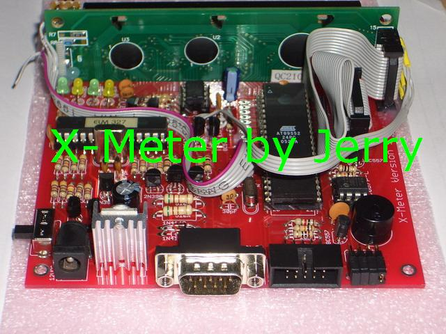

# X-Meter: A DIY OBD2 Multi-Gauge and Diagnostic Tool

## Introduction

This repository contains the complete project files for the X-Meter, a custom-built, DIY hardware device for automotive diagnostics and real-time data display. The project was developed around 2007 and appears to be a passion project for the car enthusiast community.

The X-Meter connects to a vehicle's OBD2 port and provides a wealth of information, acting as a multi-gauge, trip computer, and diagnostic scanner.

## Features

The X-Meter is packed with features:

*   **Real-time Data Display:** Shows two selectable engine parameters simultaneously. Supported parameters include:
    *   Engine Speed (RPM) & Vehicle Speed
    *   Coolant & Intake Air Temperature
    *   Engine Load & Throttle Position
    *   Short/Long Term Fuel Trim
    *   Fuel Pressure & Air Flow Rate
    *   Ignition Timing Advance
    *   Oxygen Sensor Voltages
    *   ...and many more.
*   **Diagnostic Tool:**
    *   Read and clear Diagnostic Trouble Codes (DTCs).
    *   Reset the Powertrain Control Module (PCM).
    *   Read the Vehicle Identification Number (VIN).
*   **Customizable Alerts:** Set visual and audible warnings for user-defined limits, such as high coolant temperature or engine RPM.
*   **Configurable Interface:**
    *   Adjust backlight and sound settings.
    *   Select which parameters to display.
    *   Auto-sleep mode when the engine is off.
*   **Expandable Hardware:** The design includes an extension port for adding future functionality like cruise control or GPS.

## Gallery

| | |
|:---:|:---:|
|  |  |
|  |  |
|  |  |

## Project Structure

This project is divided into several folders, each containing a different part of the X-Meter ecosystem.

*   `WEBPAGE/`: Contains the original HTML webpage and images used to document the project.
*   `Manual/`: Contains the user manual and related images.
*   `X-METER1Eagle/` & `X-METER2Eagle/`: Hardware design files (schematics and PCB layouts) for two versions of the X-Meter, created in Eagle CAD.
*   `XFirmware/`: The 8051 assembly source code (`.asm`) and compiled firmware (`.hex`) for the device.
*   `Hex2Const/`: A Delphi project, likely a utility for firmware development.
*   `XUpdater/`: Files related to the PC-based firmware updater tool.
*   `XMETER_protytype/`: Contains files from the early prototyping stage of the project.

## Hardware

The hardware is custom-designed. The schematics and PCB layout files are in the `X-METER1Eagle/` and `X-METER2Eagle/` directories and can be opened with Autodesk Eagle CAD. The design is based on an 8051 microcontroller and an OBD2 interface chip.

## Firmware

The firmware is written in Assembly language for an 8051-compatible microcontroller. The source code can be found in the `XFirmware/` directory. The project was developed using the "MCU 8051 IDE".

## Software

A companion PC application, "X-Meter Updater," was created to flash new firmware to the device. The source code, written in Delphi/Pascal, is located in the `Hex2Const/` folder.

## Disclaimer

This is a legacy project from circa 2007. The files are provided as-is for historical and educational purposes. Some of the tools, libraries, and links in the original documentation may be outdated.

## Credits

This project was designed and developed by **Jerry**.
